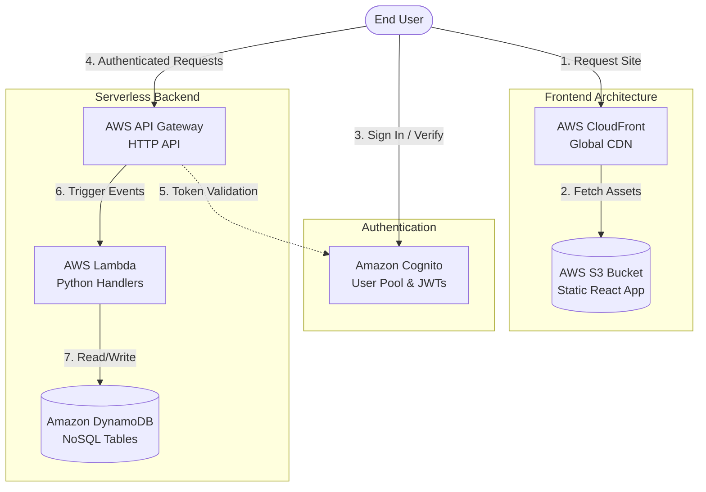

# Chesspunk Serverless WebApp

This directory contains the React front-end application for the **Chesspunk** platform. 

The application is built with a strictly **100% Serverless Philosophy**. It is designed to be highly scalable, extremely low-cost when idle, and globally distributed.

## 🎯 Scope & Goals
The goal of this WebApp is to provide a premium, modern interface for chess players to join communities, register for tournaments, and view their matches.

**Key Architectural Goals:**
1. **Serverless Deployment**: The entire application is statically compiled and deployed to an AWS S3 Bucket.
2. **Global CDN**: Assets are distributed globally using AWS CloudFront, ensuring sub-second load times regardless of the user's location.
3. **Cryptographic Identity**: User authentication (Sign Up, Sign In, Verification) bypasses standard application servers and interacts directly with AWS Cognito.
4. **Direct API Integration**: The frontend fetches data directly from AWS API Gateway backed by AWS Lambda functions.

---

## ☁️ Architecture Diagram



---

## 🏗️ How It Was Implemented

### Technology Stack
- **Framework**: React 19 + Vite (for lightning-fast HMR and optimized builds).
- **Styling**: Custom CSS featuring a premium dark-mode glassmorphic design system (`index.css`). No heavy component libraries were used, ensuring a tiny bundle size.
- **Routing**: `react-router-dom` with nested routing to support persistent layouts (e.g., the unified Player and Admin Sidebar Dashboards).
- **Authentication**: AWS Amplify (`@aws-amplify/auth`) is used to securely manage JWT tokens and connect to AWS Cognito User Pools.
- **Infrastructure as Code (IaC)**: The Serverless Framework v4.

### The Authentication Architecture
The `AuthContext.jsx` file is the heart of the application. It utilizes AWS Amplify to handle real sign-ups, email verification confirmation flows, and secure sign-ins. 
If AWS environment variables are missing, the context will intelligently fall back to a "Mock Development" mode so UI development can continue without network errors.

### The API Architecture
The `useApi.js` hook automatically intercepts outbound API requests, checks the AuthContext for an active AWS Cognito session, extracts the JSON Web Token (JWT), and securely injects it into the `Authorization: Bearer` header.

---

## 🛠️ Environment Setup

To continue development locally, you need to populate your environment variables with your active AWS infrastructure IDs.

1. **Install Dependencies**
   ```bash
   npm install
   ```

2. **Configure Environment Variables**
   Create a `.env` file in the root of the `webapp/` folder. 
   *(Note: You can get these values by running `aws cloudformation describe-stack-resources` on your backend stack).*
   ```env
   VITE_API_URL=https://<your-api-id>.execute-api.us-east-1.amazonaws.com
   VITE_COGNITO_REGION=us-east-1
   VITE_COGNITO_USER_POOL_ID=<your-pool-id>
   VITE_COGNITO_CLIENT_ID=<your-client-id>
   ```

3. **Run the Development Server**
   ```bash
   npm run dev
   ```
   The app will launch at `http://localhost:5173`. Any changes to the React components will hot-reload instantly.

---

## 🚀 Deployment

We use the Serverless Framework combined with the `serverless-s3-sync` plugin to automate the deployment.

Our `serverless.yml` provisions:
- An S3 Bucket for static hosting.
- A Bucket Policy allowing public read.
- A CloudFront CDN pointing to the S3 bucket.

### How to Deploy
1. Ensure your AWS CLI is authenticated (e.g., you have run `aws sso login` or configured your `~/.aws/credentials`).
2. Run the deployment script:
   ```bash
   npm run deploy
   ```

**What happens under the hood?**
1. Vite compiles your React code, minifies it, and outputs the final raw HTML/CSS/JS into the `/dist` folder.
2. Serverless framework provisions your S3 bucket and CloudFront distribution.
3. The `serverless-s3-sync` plugin securely uploads the contents of `/dist` to your S3 bucket.
4. The terminal will output your live `.cloudfront.net` URL!
